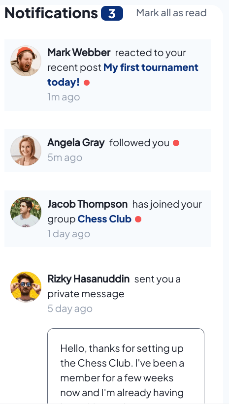
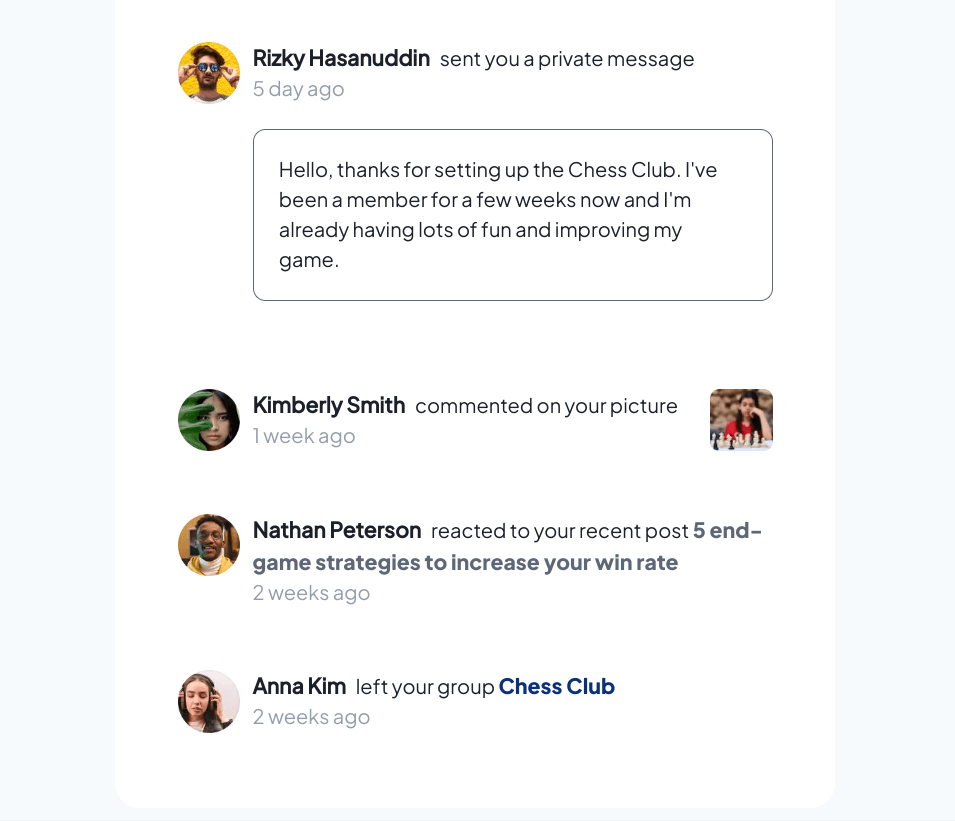
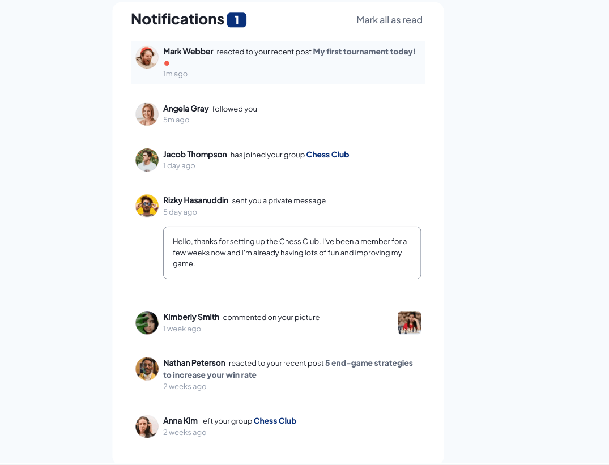
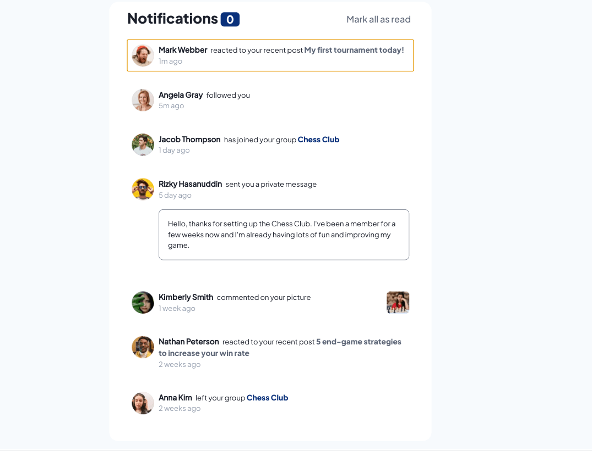
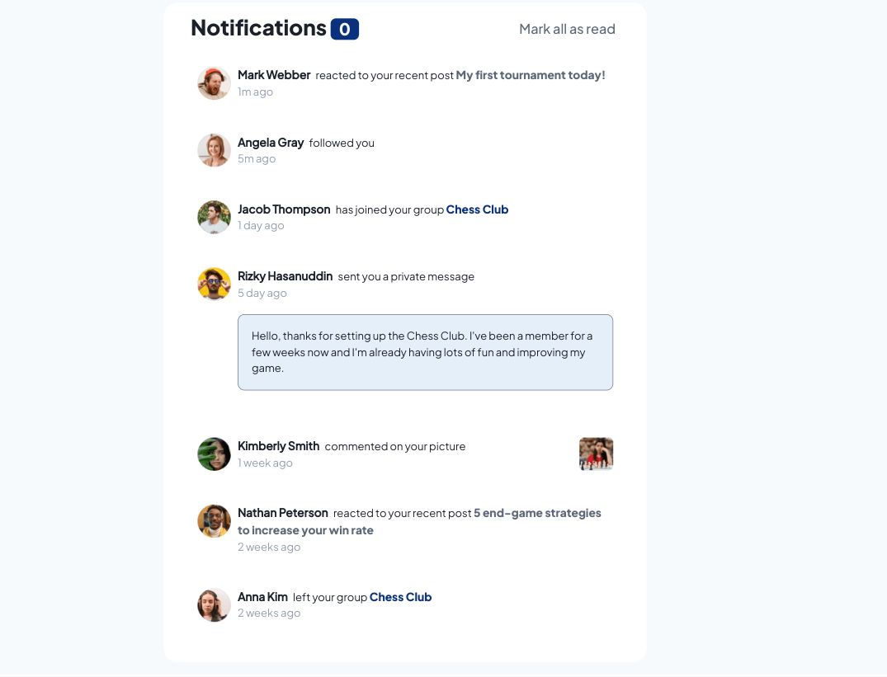

# Frontend Mentor - Notifications page solution

This is a solution to the [Notifications page challenge on Frontend Mentor](https://www.frontendmentor.io/challenges/notifications-page-DqK5QAmKbC). Frontend Mentor challenges help you improve your coding skills by building realistic projects. 

## Table of contents

- [Overview](#overview)
  - [The challenge](#the-challenge)
  - [Screenshot](#screenshot)
  - [Links](#links)
- [My process](#my-process)
  - [Built with](#built-with)
  - [What I learned](#what-i-learned)
  - [Continued development](#continued-development)
  - [Useful resources](#useful-resources)

## Overview

### The challenge

Users should be able to:

- Distinguish between "unread" and "read" notifications
- Select "Mark all as read" to toggle the visual state of the unread notifications and set the number of unread messages to zero
- View the optimal layout for the interface depending on their device's screen size
- See hover and focus states for all interactive elements on the page

### Screenshot

### Links

- Live Site URL: [Github Pages](https://jdegand.github.io/notifications-page)

## My process

### Built with

- Semantic HTML5 markup
- CSS custom properties
- BEM
- JS

### What I learned
   
- Desktop/Mobile First - doesn't really matter - I started desktop-first and had slight issue with a max-width media declaration and converted to a min-width implementation in no time.   
- CSS reset - remember to set ul padding to 0
- Used event delegation - makes perfect sense for the list of notification messages.  
- keyCode is deprecated 
- first time, frontendmentor challenge included fonts in the files - not really necessary - intentional?

### Continued development

- Font sizes are larger than design in places - don't think you should go lower than 16px - mobile font size looks to be 14px  
- Could have used javascript to add the messages - json object and function to create/append them - the slight variations of 2 messages - probably handled with a conditional
- If using framework, notification component and use && for variations
- BEM - aware of but don't really use - verbose and slows down coding - better to refactor code to afterwards ?
- Colors - hard to differentiate - the background of the notifications is too light and the other choices are too dark 
- Repetitive event handler logic in script.js -> break out into separate function -> problems with event parameter 
- Check span consistency - either add spaces inside spans or add space directly after.

### Useful resources

- [YouTube](https://www.youtube.com/watch?v=VY_7aZRGA6U) - Alert Notification
- [YouTube](https://www.youtube.com/watch?v=1EN8_OxvPuY) - Coding with Elias
- [Dev.to](https://dev.to/lennythedev/css-gotcha-how-to-fill-page-with-a-div-270j) - fill a page with a div
- [Stack Overflow](https://stackoverflow.com/questions/45497031/make-background-color-extend-into-overflow-area) - background & overflow
- [Blog](https://karlgroves.com/ridiculously-easy-trick-for-keyboard-accessibility/) - keyboard accessibility
- [Javascript.info](https://javascript.info/event-delegation) - event delegation
- [Stack Overflow](https://stackoverflow.com/questions/22119673/find-the-closest-ancestor-element-that-has-a-specific-class) - closest ancestor
- [Medium](https://devstephen.medium.com/keyboardevent-key-for-cross-browser-key-press-check-61dbad0a067a#:~:text=KeyCode%20was%20deprecated%20because%20in,to%20use%20key%20or%20code%20.) - keyCode deprecated